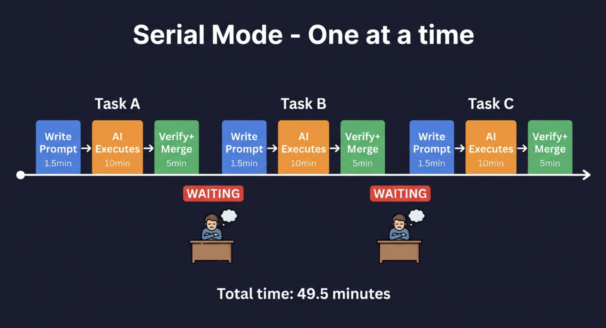
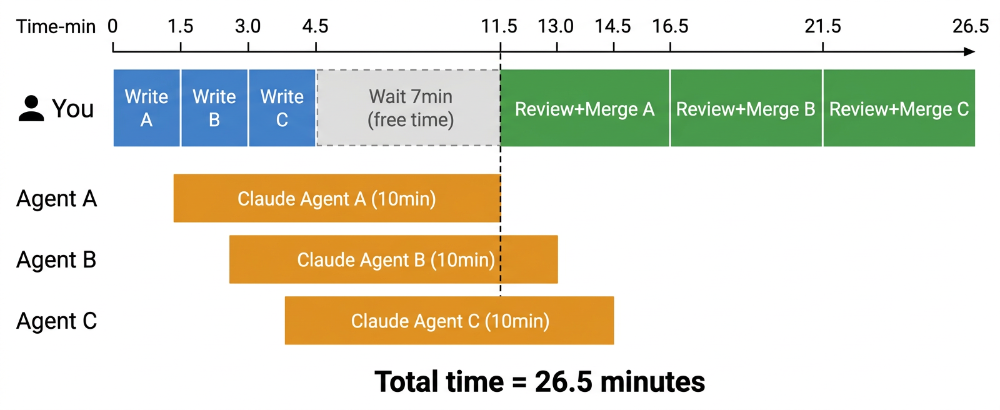
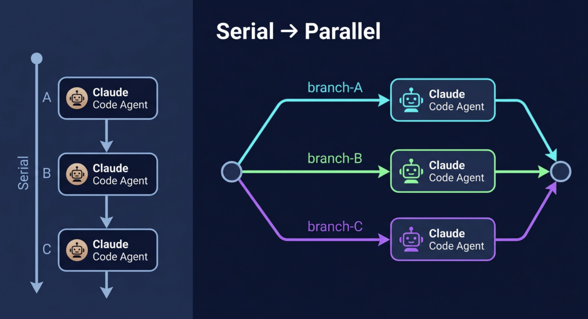
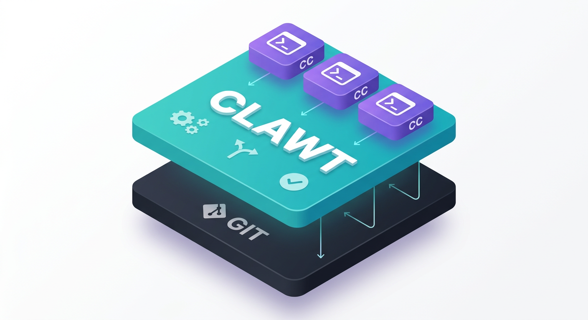
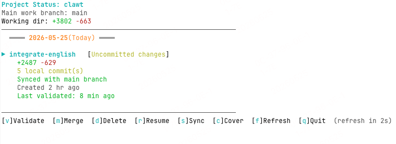

# Clawt

[](https://www.npmjs.com/package/clawt) [](https://github.com/afk101/clawt)

**[English](./README.md)** | [中文](./README.zh-CN.md)

Run multiple Claude Code Agent tasks in parallel based on Git Worktree — all agents' code changes are fully isolated from each other.

> When AI coding assistants are already smart enough, the bottleneck is no longer "can it do this" — it's "how many things can you have it do at once."

## Why Clawt

Claude Code can independently complete feature development, bug fixes, and refactoring. But in real projects, you rarely face a single task — you face an entire iteration cycle with **multiple independent tasks that could run in parallel**:

- Replace message list with virtual list
- Implement publish/deploy dialog
- Fix navbar flicker bug
- ………………

This is how most developers use Claude Code today — **serial execution**:



**3 tasks total ≈ 49.5 min.** The biggest problem: **while Claude is working on task A, B, C — you're just waiting.**

Running multiple tasks in the same repo simultaneously isn't recommended either — there's only one Git working tree, files can conflict, and commits would mix multiple independent tasks together.

## Clawt's Parallel Mode

The core idea is simple:

> **Use Git Worktree to create an isolated working directory for each task, letting multiple Claude Code Agents work in parallel on their own branches — without interfering with each other.**

Same 3 tasks, with Clawt:



**3 tasks total ≈ 26.5 min (parallel execution, sequential review)**

| Mode | 3 tasks | 10 tasks |
|------|---------|----------|
| Serial | ~49.5 min | ~165 min |
| **Clawt parallel** | **~26.5 min** | **~65 min** |
| Speedup | **1.9×** | **2.5×** |

The more tasks, the bigger the advantage. In serial mode, **you wait for AI**. In parallel mode, **AI waits for you**.

## Why Git Worktree?

Can't you just open multiple terminals and clone multiple copies? You can — but Git Worktree is the cleaner solution:

| Approach | Disk usage | Git history | Branch mgmt | Merge |
|----------|-----------|-------------|-------------|-------|
| Multiple `git clone` | Full copy per repo (hundreds of MB ~ GB) | Independent, needs remote sync | Separate, messy | Requires push/pull across repos |
| **Git Worktree** | Shared `.git` objects, minimal overhead | **Shared** | **Unified** | Local branch merge, instant |

Git Worktree is a native Git mechanism (`git worktree add`) that creates multiple working directories under one repo, each on its own branch, sharing the same `.git` object database — low disk usage, fast local operations.

## Design Philosophy

> **Human's job: think about requirements, write prompts, review code(Optional). AI's job: write code. Git Worktree is the isolation layer between them.**



> **Clawt does not modify, replace, or wrap Claude Code itself. It only manages "where" and "how many" Claude Code instances run — at a higher level.**



Everything you use inside each worktree is vanilla Claude Code — same interaction, same commands, same `CLAUDE.md`, same MCP config. Any Claude Code update automatically benefits Clawt with zero adaptation needed.

The workflow maps directly to standard Git practices:

```
┌─────────────┐    ┌──────────────────┐    ┌───────────────┐
│  clawt run   │───►│ clawt validate   │───►│  clawt merge   │
│  AI develops │    │  Human reviews   │    │  Merge to main │
│  on branch   │    │  in main worktree│    │  Clean branch  │
└─────────────┘    └──────────────────┘    └───────────────┘
```

- **`validate`**: equivalent to Code Review — view diff, run tests in the main worktree (works perfectly with hot reload)
- **`cover`**: for simple fixes (styling, constants), edit directly in the main worktree and push changes back to the target worktree
- **`merge`**: merge to main, each merge maps to one clear feature/fix — clean Git history

## Installation

```bash
npm i -g clawt
```

**Requirements:** Node.js >= 18 · Git >= 2.15 · Claude Code CLI

## Quick Start

```bash
# 1. Initialize in your project root (directory containing .git), confirm the main work branch
clawt init

# 2. Run tasks in parallel, each in its own isolated worktree
clawt run -b feat-login
clawt run -b feat-search
clawt run -b fix-bug

# 3. Open the interactive panel to monitor all task statuses and perform actions
clawt status -i
```

`clawt status -i` provides a real-time TUI panel. Use arrow keys to select a worktree, then press shortcuts to operate:

| Shortcut | Action | Equivalent Command |
| ------ | ---- | -------- |
| `v` | Validate branch changes | `clawt validate -b <branch>` |
| `m` | Merge into main branch | `clawt merge -b <branch>` |
| `r` | Resume Claude Code session | `clawt resume -b <branch>` |
| `s` | Sync main branch code | `clawt sync -b <branch>` |
| `d` | Delete worktree | `clawt remove -b <branch>` |
| `c` | Cover changes back to target worktree | `clawt cover` |
| `q` | Quit panel | — |

Example:

> All operations can also be executed via standalone commands — see "Command Reference" below.

## Command Reference

> Except for `config`, `alias`, `projects`, and `completion`, all other commands must be run in the **root directory of the main worktree**. The `-b` parameter supports fuzzy matching. Most action commands (`run`, `create`, `validate`, `merge`, etc.) require running `clawt init` first.

### `clawt init` — Initialize project-level configuration

```bash
clawt init                # Initialize with the current branch as the main work branch
clawt init -b <branch>    # Specify the main work branch name
clawt init show           # Interactively view and modify project configuration
clawt init show --json    # Output project configuration in JSON format
```

Sets the project's main work branch. Re-running updates the main work branch configuration. `init show` provides an interactive panel for viewing and modifying project settings (e.g., commands to auto-run after validate succeeds, postCreate hook commands after worktree creation, claudeCodeCommand, etc.). `init show --json` outputs the current project configuration in JSON format.

### `clawt run` — Create worktree and execute tasks

```bash
# Single worktree, opens Claude Code interactive interface (most common)
clawt run -b <branch>

# Parallel tasks (each --tasks corresponds to an independent worktree)
clawt run -b <branch> --tasks "task1" --tasks "task2"

# Read task list from a task file (uses branch names defined in the file)
clawt run -f tasks.md

# Read tasks from file, but auto-number branches with -b (branch names in file are optional)
clawt run -f tasks.md -b feat

# Dry run: preview worktrees and tasks to be created without actually executing
clawt run -b <branch> --tasks "task1" --tasks "task2" --dry-run

# Skip postCreate hook
clawt run -b <branch> --no-post-create
```

**`--dry-run` preview example:**

```
════════════════════════════════════════
  Dry Run Preview
════════════════════════════════════════
Tasks: 2 │ Concurrency: unlimited │ Worktree: ~/.clawt/worktrees/project
────────────────────────────────────────
✓ [1/2] feat-1
  Path: ~/.clawt/worktrees/project/feat-1
  Task: task1

✓ [2/2] feat-2
  Path: ~/.clawt/worktrees/project/feat-2
  Task: task2

════════════════════════════════════════
✓ Preview complete, no conflicts. Remove --dry-run to execute.
```

**Task file format:**

```markdown
<!-- CLAWT-TASKS:START -->
# branch: feat-login
Implement user login feature
<!-- CLAWT-TASKS:END -->

<!-- CLAWT-TASKS:START -->
# branch: fix-bug
Fix memory leak issue
Supports multi-line task descriptions
<!-- CLAWT-TASKS:END -->
```

> When using `-b`, the `# branch: ...` line in the file can be omitted. Branch names are auto-numbered from the `-b` value (e.g., `feat-1`, `feat-2`).

Press `Ctrl+C` to interrupt all tasks.

### `clawt resume` — Resume a previous Claude Code session

```bash
clawt resume -b <branch>   # Specify branch
clawt resume                # Interactive multi-select (grouped by creation date)

# Non-interactive follow-up
clawt resume -b <branch> --prompt "follow-up content"
clawt resume -f tasks.md    # Batch follow-up from task file
clawt resume -f tasks.md -c 2  # Limit concurrency
```

Without `-b`, the branch list is displayed grouped by creation date, supporting global select-all and per-group select-all. Selecting 1 branch resumes in a new terminal tab by default (set `resumeInPlace: true` to resume in the current terminal). Selecting multiple branches automatically resumes in separate terminal tabs in batch (macOS only).

`--prompt` is for non-interactive follow-up on a specified branch. `-f` performs batch follow-up on multiple branches from a task file (matching existing worktrees by branch name). The two are mutually exclusive.

If the target worktree has a previous session, it automatically continues the last conversation (`--continue`).

> **Note:** When batch resuming with Terminal.app, you need to grant accessibility permissions in "System Settings → Privacy & Security → Accessibility". iTerm2 requires no additional permissions. The terminal type can be configured via the `terminalApp` setting.

### `clawt create` — Create worktree only (without executing tasks)

```bash
clawt create -b <branch>           # Create 1 worktree
clawt create -b <branch> -n 3      # Batch create 3 worktrees
clawt create -b <branch> --no-post-create  # Skip postCreate hook
```

### `clawt validate` — Validate branch changes in the main worktree

```bash
clawt validate -b <branch>                    # Migrate changes to main worktree for testing
clawt validate -b <branch> --clean             # Clean up validate state
clawt validate -b <branch> -r "npm test"       # Auto-run tests after successful validation
clawt validate -b <branch> -r "npm run build"  # Auto-build after successful validation
clawt validate -b <branch> -r "pnpm test & pnpm build"  # Run multiple commands in parallel
```

Supports incremental mode: when re-validating the same branch, you can view incremental diffs between validations via `git diff`.

Automatically removes external symlinks (e.g., `node_modules` links to the main worktree) before detecting changes — these symlinks, typically created by AI Agents, can cause patch apply failures.

When patch apply fails (target branch diverges too much from main), it automatically prompts whether to run `sync` to synchronize the main branch to the target worktree — no manual action needed.

The `-r, --run` option auto-executes a specified command in the main worktree after successful validation (e.g., tests, builds). Command failure does not affect the validation result. Without `-r`, it automatically reads from the project's `validateRunCommand` config (configurable via `clawt init show`). Use `&` to separate multiple commands for parallel execution:

| Usage | Behavior |
| ---- | ---- |
| `-r "npm test"` | Single command, synchronous |
| `-r "npm lint && npm test"` | `&&` is not split, synchronous |
| `-r "pnpm test & pnpm build"` | Parallel execution, waits for all to complete |

### `clawt cover` — Cover validated branch changes back to target worktree

```bash
clawt cover    # Execute on the validate branch, auto-deduces target branch
```

During validation, if you modified code on the main worktree (on the validate branch), use `cover` to push those changes back to the target worktree. When there are no working directory changes, it prompts for confirmation to avoid accidental operations.

### `clawt sync` — Sync main branch code to target worktree

```bash
clawt sync -b <branch>
```

Also automatically prompted when `validate` patch apply fails — usually no manual invocation needed.

### `clawt merge` — Merge branch into main worktree

```bash
clawt merge -b <branch> -m "feat: commit message"   # Specify commit message via -m
clawt merge -b <branch>                               # In interactive mode, prompts for commit message if there are uncommitted changes
clawt merge -b <branch> --auto                        # Resolve conflicts with AI automatically
```

In interactive mode, if the target worktree has uncommitted changes or a commit message is needed after squash, it automatically prompts for input — no need to specify `-m` in advance. In non-interactive mode (`-y` / CI), it exits with an error if `-m` is not provided.

### `clawt remove` — Remove worktree

```bash
clawt remove -b <branch>    # Remove worktree for specified branch (supports fuzzy matching)
clawt remove                 # Interactive multi-select worktrees to remove (grouped by creation date)
clawt remove --all           # Remove all worktrees for the current project
```

### `clawt list` — List all worktrees

```bash
clawt list            # Text format
clawt list --json     # JSON format
```

### `clawt status` — Project status overview

```bash
clawt status          # Text format
clawt status --json   # JSON format
clawt status -i       # Interactive panel mode (real-time refresh, keyboard navigation and shortcuts)
```

Displays the main worktree status, change details for each worktree (including branch creation time and validation status), and validate snapshot summaries.

Interactive panel mode (`-i`) provides a real-time TUI interface with arrow key navigation and shortcut-driven operations:

| Shortcut | Action |
| ------ | ---- |
| `↑` `↓` | Navigate and select worktree |
| `v` `m` `d` `r` `s` `c` | Validate / Merge / Delete / Resume / Sync / Cover |
| `f` | Manual refresh |
| `q` / `Ctrl+C` | Quit |

### `clawt reset` — Reset main worktree to clean state

```bash
clawt reset
```

### `clawt home` — Switch back to main work branch

```bash
clawt home
```

If already on the main work branch, a message indicates no switch is needed.

### `clawt tasks` — Task file management

```bash
clawt tasks init             # Generate task template file (defaults to .clawt/tasks/ directory)
clawt tasks init [path]      # Specify output path
```

Quickly generates the task file template needed by `clawt run -f`, including format instructions and example task blocks.

### `clawt projects` — Cross-project worktree overview

```bash
clawt projects             # View all projects overview
clawt projects my-project  # View worktree details for a specific project
clawt projects --json      # JSON format output
```

Displays worktree counts, disk usage, and last active time for all projects, or detailed information for each worktree under a specific project.

### `clawt config` — Interactively view and modify configuration

```bash
clawt config                          # Interactive modification (select config items and modify values)
clawt config set <key> <value>        # Directly set a config item
clawt config get <key>                # Get a config item's value
clawt config reset                    # Restore default configuration
```

**Usage examples:**

```bash
# Interactive modification (lists all config items, arrow key selection, auto-prompts by type)
clawt config

# Direct setting
clawt config set autoDeleteBranch true
clawt config set maxConcurrency 4
clawt config set terminalApp iterm2

# View a config item
clawt config get maxConcurrency
```

### `clawt completion` — Shell auto-completion

Provides auto-completion for commands, subcommands, options, and even branch names and config keys in the terminal.

```bash
# Auto-install completion script (recommended)
clawt completion install

# Or manually add the script to your shell config file
clawt completion bash >> ~/.bashrc
clawt completion zsh >> ~/.zshrc
```
> **Supported features:** All subcommands, options, `-b` parameter auto-completes local worktree branch names, `-f` parameter auto-completes file paths, and `config set/get` key name auto-completion.

### `clawt alias` — Manage command aliases

```bash
clawt alias                          # List all command aliases
clawt alias list                     # List all command aliases
clawt alias set <alias> <command>    # Set a command alias
clawt alias remove <alias>           # Remove a command alias
```

**Usage examples:**

```bash
# Set aliases
clawt alias set l list
clawt alias set r run
clawt alias set v validate

# Use aliases (equivalent to the corresponding full commands)
clawt l          # Equivalent to clawt list
clawt r task.md  # Equivalent to clawt run task.md

# Remove alias
clawt alias remove l
```

> **Constraints:** Aliases cannot override built-in command names, and targets must be registered built-in commands. Options and arguments of aliases are fully passed through to the target command.

## Configuration

Configuration file is located at `~/.clawt/config.json`, auto-generated after installation:

| Config Item | Default | Description |
| ------ | ------ | ---- |
| `language` | `"en"` | Interface language: `en` (English) / `zh-CN` (Chinese) |
| `autoDeleteBranch` | `false` | Auto-delete merged/removed branches |
| `claudeCodeCommand` | `"claude"` | Claude Code CLI launch command (can be overridden per-project via `clawt init show`) |
| `autoPullPush` | `false` | Auto pull/push after merge |
| `confirmDestructiveOps` | `true` | Confirm before destructive operations |
| `maxConcurrency` | `0` | Max concurrency for run command, `0` means unlimited |
| `terminalApp` | `"auto"` | Terminal for batch resume: `auto` / `iterm2` / `terminal` / `cmux` |
| `resumeInPlace` | `false` | Resume single selection in current terminal; `false` opens in new tab |
| `aliases` | `{}` | Command alias mapping (e.g., `{"l": "list", "r": "run"}`) |
| `autoUpdate` | `true` | Auto-check for new versions (checks npm registry every 24 hours) |
| `conflictResolveMode` | `"ask"` | Merge conflict resolution mode: `ask` (prompt for AI), `auto` (auto AI resolve), `manual` (manual resolve) |
| `conflictResolveTimeoutMs` | `900000` | Claude Code conflict resolution timeout (ms), default 15 minutes |

## postCreate Hook

Automatically execute any initialization commands after worktree creation (e.g., install dependencies, generate config files, compile resources, etc.). Supported by both `create` and `run` commands.

**Configuration (choose one):**

1. **Project config**: Set the `postCreate` field via `clawt init show` (e.g., `npm install`)
2. **Script file**: Create `.clawt/postCreate.sh` in the project root and grant execute permission

Project config takes priority over the script file. Use `--no-post-create` to skip hook execution.

Hooks run asynchronously in the background (fire-and-forget), not blocking the main flow. Results are only logged.

## Global Options

| Option | Description |
| ---- | ---- |
| `--debug` | Output debug information |
| `-y, --yes` | Skip all interactive confirmations, suitable for scripts/CI environments |

## Environment Variables

| Variable | Description |
| -------- | ---- |
| `CI` | When set to `true` or `1`, enables non-interactive mode (equivalent to `--yes`) |
| `CLAWT_NON_INTERACTIVE` | When set to `true` or `1`, enables non-interactive mode (equivalent to `--yes`) |

> **Priority:** `--yes` > `CI` > `CLAWT_NON_INTERACTIVE` > default interactive mode

**Internally injected environment variables:**

All non-interactive Claude Code sessions launched via `claude -p` (task-executor and conflict-resolver) automatically inject the environment variable `CLAUDE_CODE_ENTRYPOINT="cli"`, which enables these sessions to be resumed via `--continue`. This does not apply to interactive Claude Code sessions (e.g., `clawt resume`).

## Logs

Logs are saved in `~/.clawt/logs/`, rotated by date, retained for 30 days.
